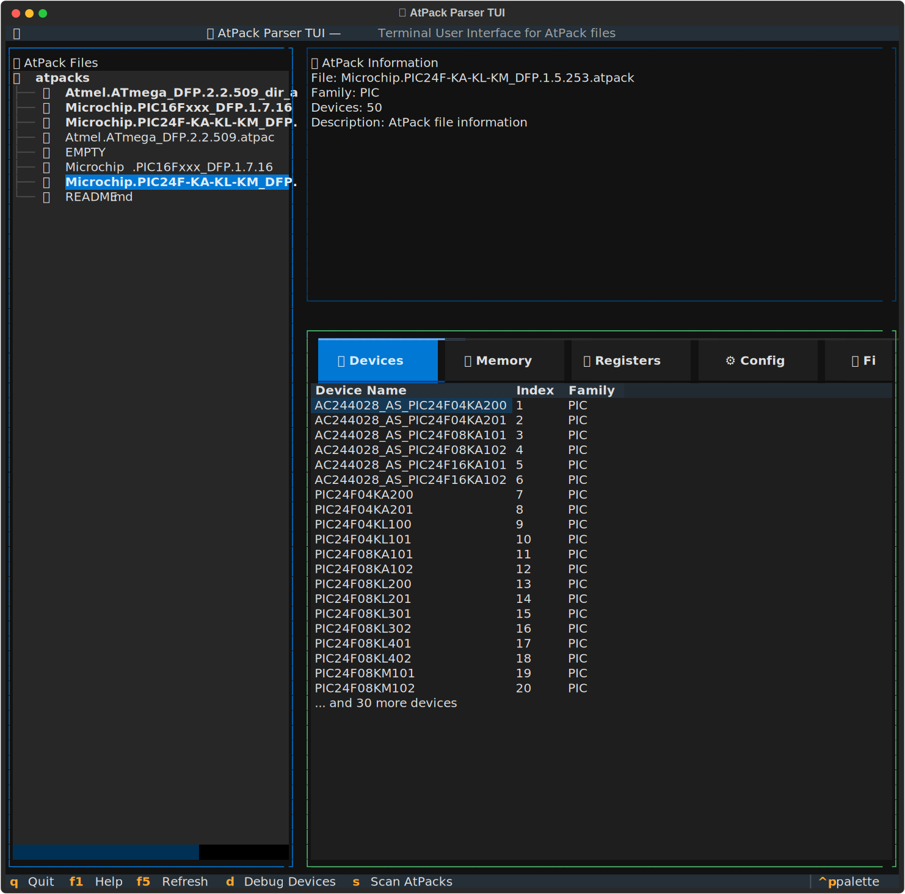

# Terminal User Interface (TUI)

!!! warning
    This feature is still in development. It is not yet ready for production.

## Launching the TUI
Launch the interactive Terminal User Interface:

```bash
atpack tui [DIRECTORY]
```

**Examples:**
```bash
# Launch TUI with default directory (./atpacks/)
atpack tui

# Launch TUI with custom directory
atpack tui ./my_atpacks/

# Launch TUI with absolute path
atpack tui C:\path\to\atpack\files\

# Launch TUI from current directory
atpack tui .
```

## Features

The TUI provides a visual interface with:
- **File Browser**: Browse and select AtPack files
- **Device Explorer**: View devices in a tabbed interface
- **Memory Viewer**: Visualize memory layouts
- **Register Inspector**: Explore registers and bitfields
- **Configuration Panel**: View fuses, interrupts, and signatures

**Key Features:**
- Mouse and keyboard navigation
- Real-time file browsing
- Tabbed interface for different data views
- Search and filter capabilities
- Export functionality

**Prerequisites:**
```bash
# Install with TUI support
pip install atpack-parser[tui]

# Or install textual separately
pip install textual
```

**Key Bindings:**
- `F1`: Help
- `F5`: Refresh
- `Q` or `Ctrl+C`: Quit
- `Tab`: Navigate between panels
- Arrow keys: Navigate within panels

## Screenshots



